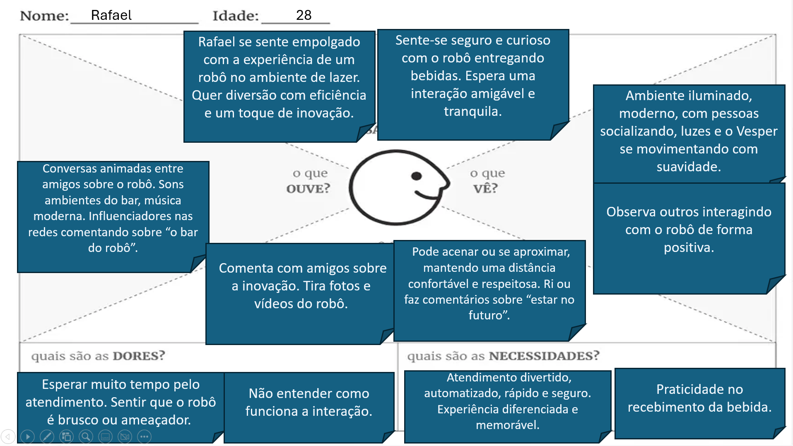
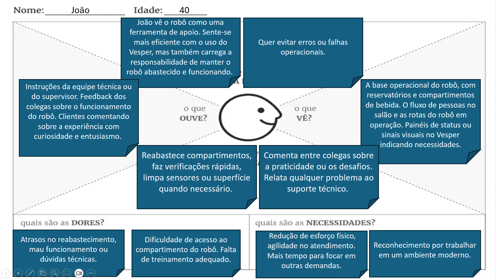

# **Vesper:** Robô Bartender

Trabalho de Interação Humano-Robô (IHR) apresentado ao Centro Universitário [FEI](https://portal.fei.edu.br/), como parte dos requisitos necessários para aprovação na disciplina de Interação Humano-Robô (IHR) (CCR230) do curso de Engenharia de Robôs, orientado pelo Prof. Dr. [Fagner de Assis Moura Pimentel](https://github.com/fagnerpimentel).

### Componentes do Grupo

- João Victor de Assis Segantin

### Resumo

O robô Vesper é um bartender automatizado desenvolvido para operar em restaurantes de padrão médio-alto com perfil tecnológico. Ele é responsável pela preparação e distribuição de bebidas diretamente no balcão do bar, onde os próprios clientes se dirigem para realizar seus pedidos. O Vesper atua de forma fixa, com braços robóticos responsáveis pela manipulação precisa dos insumos e preparo das bebidas. Sua aplicação visa otimizar o tempo de atendimento, reduzir a carga de trabalho dos garçons e garantir padronização e agilidade na entrega dos pedidos. Além disso, o robô conta com interação verbal por meio de alto-falantes e elementos de interação não verbal e espacial, promovendo uma experiência moderna e envolvente para os clientes.

### Introdução

A automação tem se consolidado como uma das principais tendências para enfrentar os desafios operacionais em diversos setores da economia, especialmente naqueles em que a agilidade e a eficiência no atendimento são fatores críticos para a satisfação do cliente. No setor gastronômico, restaurantes de médio a alto padrão têm buscado formas de incorporar tecnologias que agreguem valor à experiência dos frequentadores sem comprometer a qualidade do serviço humano. Um dos principais gargalos identificados nesse contexto é o atendimento em bares, onde a preparação e a entrega de bebidas durante horários de pico podem gerar filas, atrasos e sobrecarga dos garçons.

A proposta de robôs bartenders emerge como uma solução estratégica e inovadora diante dessa realidade. Além de aliviar a carga de trabalho da equipe humana, esses sistemas automatizados contribuem para a padronização das bebidas, reduzem falhas humanas e proporcionam uma experiência diferenciada ao cliente, alinhada às expectativas de um público cada vez mais conectado com soluções tecnológicas.

Neste cenário, foi desenvolvido o Vesper, um robô bartender fixo, projetado para operar em um bar dentro de um restaurante tecnologicamente sofisticado. O Vesper é responsável por receber os pedidos de bebidas diretamente dos clientes, preparar e entregá-las de maneira precisa e eficiente. Equipado com braços robóticos, sensores, saídas de áudio para interação verbal e cortinas de segurança para proteção dos usuários, ele representa uma fusão entre funcionalidade e design. Apesar de ser uma estação fixa, sua interação é pensada para transmitir simpatia e modernidade, sem causar estranhamento ao público.

### Publico Alvo

O robô bartender Vesper foi desenvolvido para atender um público que frequenta restaurantes de padrão médio-alto, em ambientes onde a tecnologia e a sofisticação fazem parte da proposta de valor do estabelecimento. Esse público busca agilidade no atendimento, praticidade no processo de pedidos e, ao mesmo tempo, experiências diferenciadas e inovadoras. Além disso, o Vesper também interage com os colaboradores do restaurante, principalmente os garçons responsáveis pelo suporte logístico da operação.

### Personas
Persona Primária – Cliente do restaurante
Nome: Carolina
Idade: 34 anos
Profissão: Designer de interiores
Contexto social e econômico: Classe média-alta, frequenta restaurantes premium e valoriza experiências gastronômicas inovadoras. Está conectada às tendências tecnológicas e busca ambientes que combinem conforto, estilo e praticidade.
Cultura e comportamento: Gosta de tirar fotos e compartilhar experiências nas redes sociais. Valoriza atendimento ágil e tem baixa tolerância a longas esperas.

O que o robô precisa saber antes de iniciar a tarefa:

O tipo de bebida desejada (menu com opções claras)

Restrições (como opção sem álcool ou alergias)

Confirmação de idade, para validar legalmente a entrega de bebidas alcoólicas

Persona Secundária – Garçom reabastecedor
Nome: Diego
Idade: 27 anos
Profissão: Garçom
Contexto social e econômico: Jovem trabalhador da área de serviços, com ensino médio completo e experiência em atendimento ao público. Trabalha em um restaurante de alto padrão onde eficiência e organização são essenciais.
Cultura e comportamento: Preza por praticidade, clareza nas tarefas e bom ambiente de trabalho. Está habituado a lidar com sistemas digitais e alertas operacionais.

O que o robô precisa saber antes de iniciar a tarefa:

Se os insumos estão no nível adequado (o próprio robô detecta e envia alertas)

Qual item está faltando ou precisa de reposição (ex: gelo, bebida alcoólica, copos)

Local de armazenamento para facilitar o reabastecimento

Outras personas
Gestores do restaurante: Avaliam o desempenho do robô em termos de custo-benefício, eficiência no atendimento e feedback dos clientes.

Técnicos de manutenção: Responsáveis por garantir o funcionamento contínuo do robô, atualizando software e monitorando o hardware.

Personas que não devem interagir com o robô
Crianças e adolescentes (menores de 18 anos):
Como o Vesper é projetado para servir bebidas alcoólicas, sua interação com menores de idade é estritamente proibida. Medidas preventivas devem ser tomadas, como bloqueios físicos, cortinas de segurança e futuros mecanismos de verificação de idade, para garantir a operação ética e segura do sistema.

### Mapa de empatia

### Persona Primária: Rafael, 28 anos, publicitário
O que ele PENSA E SENTE?
Rafael se sente empolgado com a experiência de um robô no ambiente de lazer. Quer diversão com eficiência e um toque de inovação. Sente-se seguro e curioso com o robô entregando bebidas. Espera uma interação amigável e tranquila.

O que ele ESCUTA?
Conversas animadas entre amigos sobre o robô. Sons ambientes do bar, música moderna. Influenciadores nas redes comentando sobre “o bar do robô”.

O que ele VÊ?
Ambiente iluminado, moderno, com pessoas socializando, luzes e o Vesper se movimentando com suavidade. Observa outros interagindo com o robô de forma positiva.

O que ele FALA E FAZ?
Comenta com amigos sobre a inovação. Tira fotos e vídeos do robô. Pode acenar ou se aproximar, mantendo uma distância confortável e respeitosa. Ri ou faz comentários sobre “estar no futuro”.

DOR:
Esperar muito tempo pelo atendimento. Sentir que o robô é brusco ou ameaçador. Não entender como funciona a interação.

GANHOS:
Atendimento divertido, automatizado, rápido e seguro. Experiência diferenciada e memorável. Praticidade no recebimento da bebida.

### Persona Secundária: João, 40 anos, garçom
O que ele PENSA E SENTE?
João vê o robô como uma ferramenta de apoio. Sente-se mais eficiente com o uso do Vesper, mas também carrega a responsabilidade de manter o robô abastecido e funcionando. Quer evitar erros ou falhas operacionais.

O que ele ESCUTA?
Instruções da equipe técnica ou do supervisor. Feedback dos colegas sobre o funcionamento do robô. Clientes comentando sobre a experiência com curiosidade e entusiasmo.

O que ele VÊ?
A base operacional do robô, com reservatórios e compartimentos de bebida. O fluxo de pessoas no salão e as rotas do robô em operação. Painéis de status ou sinais visuais no Vesper indicando necessidades.

O que ele FALA E FAZ?
Reabastece compartimentos, faz verificações rápidas, limpa sensores ou superfície quando necessário. Comenta entre colegas sobre a praticidade ou os desafios. Relata qualquer problema ao suporte técnico.

DOR:
Atrasos no reabastecimento, mau funcionamento ou dúvidas técnicas. Dificuldade de acesso ao compartimento do robô. Falta de treinamento adequado.

GANHOS:
Redução de esforço físico, agilidade no atendimento. Mais tempo para focar em outras demandas. Reconhecimento por trabalhar em um ambiente moderno.

### Contexto de uso
Ambiente de interação:
O Vesper opera em ambientes sociais fechados como bares temáticos, lounges modernos, feiras tecnológicas, eventos corporativos ou ambientes universitários voltados à inovação. O espaço possui fluxo moderado de pessoas, iluminação controlada, mesas distribuídas com corredores largos o suficiente para permitir a movimentação segura do robô. Há uma área reservada para reabastecimento supervisionada por funcionários.

Contexto social, econômico e cultural:
O ambiente é composto majoritariamente por adultos jovens e profissionais de classe média urbana, com interesse por tecnologia, inovação e experiências diferenciadas. Culturalmente, trata-se de um público habituado a novidades digitais, que consome conteúdo em redes sociais e valoriza serviços automatizados. O uso do robô agrega um diferencial futurista ao local e reforça o posicionamento da marca como inovadora.

# Informações que o robô deve saber antes de iniciar a tarefa:
Mapeamento do ambiente: 
Localização das mesas, pontos de recarga, rota segura de circulação, áreas de restrição (como zonas com crianças).

Controle de volume:
 Adequação do nível dos speakers ao ambiente (evitando sons altos em locais mais silenciosos ou ao se aproximar dos clientes).

Presença de obstáculos: 
Localização de objetos fora do lugar, acúmulo de pessoas ou móveis que interfiram na rota.

Nível de bebida no compartimento:
Evitar iniciar entregas com estoque insuficiente.

Identificação de zonas proibidas: 
O robô deve reconhecer áreas onde sua presença não é recomendada, como mesas infantis, pistas de dança ou corredores estreitos.

Estado do ambiente: 
Nível de iluminação, se há som ambiente alto, clima (para adaptar eventuais mensagens ou tom de voz).

## Jornada do usuário

Narrativa:
No ambiente de um bar tecnológico, o cliente se dirige até o balcão, onde encontra o robô Vesper posicionado de forma fixa. O robô está protegido por uma cortina de segurança transparente que delimita claramente seu espaço de atuação, impedindo contato direto entre os usuários e suas partes móveis. A ativação acontece exclusivamente por meio do toque no tablet localizado na frente da base do robô, fora da zona de segurança.

Jornada passo a passo:

Início da interação (verbal):
O cliente toca na tela do tablet para iniciar o pedido. Isso desperta o sistema do Vesper, que responde de forma simpática por meio dos alto-falantes:
“Sejam bem-vindos!!”

Escolha da bebida (verbal):
A tela exibe o menu de bebidas. Enquanto o cliente navega, o robô continua guiando a interação verbalmente:
“Por favor, selecione no tablet abaixo a sua bebida! Basta selecionar a bebida e concluir o pedido. Depois só esperar que vou começar o preparo!”

Preparo da bebida (não-verbal):
O Vesper inicia o processo de preparo automatizado dentro da zona protegida por cortina. Seus braços se movem de forma suave e controlada. LEDs indicam o status da operação.

Entrega (verbal e não-verbal):
Com a bebida pronta, o braço do robô estende cuidadosamente o copo até a borda da área segura, posicionando-o na altura de retirada. Nesse momento, o robô anuncia:
“Bebida pronta! Pegue com cuidado dos meus dedos, pode escorregar!”

O cliente apenas estende o braço até a área permitida e retira o copo. Não há entrada na zona do robô nem qualquer tipo de deslocamento por parte da máquina.

Encerramento (verbal):
Após a retirada do copo, o robô volta para sua posição inicial e agradece:
“Espero que tenha gostado! Obrigado e volte sempre!”

Ambiente durante a interação:

O bar permanece funcional, com música ambiente e movimento moderado.

A cortina de segurança delimita claramente o espaço do robô, reforçando a segurança da interação.

Não há movimentação do robô no espaço físico – ele permanece totalmente estático.

A única interface física acessível ao cliente é o tablet, que fica fora da zona de segurança.

Resumo das interações:

Interações verbais:

“Sejam bem-vindos!!”

“Por favor selecione no tablet abaixo a sua bebida!”

“Basta selecionar a bebida e concluir pedido.”

“Depois só esperar que vou começar o preparo!”

“Bebida pronta!”

“Pegue com cuidado dos meus dedos, pode escorregar!”

“Espero que tenha gostado!”

“Obrigado e volte sempre!”

Interações não-verbais:

Luzes LED indicam status do preparo

Braço do robô entrega o copo até a borda da área segura

Interações espaciais:

Extremamente limitadas e restritas à zona frontal do robô

Usuário apenas estende a mão para pegar a bebida em ponto seguro

A cortina de segurança impede qualquer outro tipo de aproximação

## Análise de concorrência

Para o desenvolvimento do robô bartender Vesper, foram estudadas três plataformas já existentes que exercem funções semelhantes no mercado de automação de serviços de bebidas. A seguir, apresentamos uma análise comparativa entre elas e o Vesper:

Concorrentes diretos:

a) Makr Shakr
Descrição: Robô bartender com braços industriais (tipo KUKA) que preparam drinks em bares automatizados. Utilizado em cruzeiros, eventos e estabelecimentos premium.

Pontos positivos:

Alto grau de automação

Capacidade de preparo personalizado de coquetéis

Design chamativo que atrai o público

Pontos negativos:

Alto custo de implementação e manutenção

Estrutura complexa e de grandes dimensões

Pouca interação social real (é mais espetáculo do que serviço cotidiano)

b) BierPaulii Robot
Descrição: Robô fixo alemão voltado para o serviço de cervejas. Ele abre garrafas e serve canecas automaticamente.

Pontos positivos:

Simples, direto e funcional

Excelente para ambientes de alto volume (festas, festivais, etc.)

Interação rápida e divertida

Pontos negativos:

Limitado a bebidas específicas (cervejas)

Pouca personalização de atendimento

Aparência rústica e industrial

c) Schank-Robot
Descrição: Sistema de autosserviço de bebidas que integra robótica e esteiras automatizadas. Voltado para grandes eventos e feiras.

Pontos positivos:

Alta produtividade em grande escala

Ideal para ambientes com alto fluxo e pouca personalização

Baixo tempo de espera

Pontos negativos:

Interação limitada ao digital

Não proporciona experiência personalizada ou estética

Pouco atrativo em ambientes sofisticados

Plataforma similar ao Vesper (mesmo público e funcionalidades):
O Makr Shakr é a plataforma mais próxima do Vesper em termos de mercado-alvo e funcionalidades. Ambos atuam em ambientes sofisticados, com foco em drinks e experiência.

Pontos positivos do Makr Shakr: grande capacidade técnica e visual futurista.

Pontos negativos: alto custo, complexidade de manutenção e possível desconexão emocional com o usuário.

Plataforma diferente no serviço, mas que atende o mesmo mercado:
O BierPaulii atende o mesmo público em eventos descontraídos, mas de maneira diferente — focado em cervejas e cervejarias.

Pontos positivos: praticidade, velocidade, robustez.

Pontos negativos: pouca flexibilidade e estética industrial, o que o distancia do ambiente sofisticado visado pelo Vesper.

Plataforma mais interessante para a equipe:
O Makr Shakr é considerado a plataforma mais inspiradora. Apesar da sua complexidade, ele demonstra como um robô pode transformar o preparo de bebidas em uma experiência visual e funcional. No entanto, o Vesper se destaca por buscar um equilíbrio entre tecnologia acessível, segurança e estética adaptada a ambientes de médio porte. Ele mantém uma proposta mais contida, segura e funcional, sem deixar de lado a interação amigável e o apelo visual.

## Design

O Vesper foi projetado para ser um robô bartender fixo, com foco em acessibilidade, segurança, estética moderna e experiência intuitiva. Seu design é composto por formas simples e bem definidas, priorizando clareza funcional e segurança no uso.

Affordances e acessibilidade

O conceito de affordance foi considerado para garantir que a interação com o Vesper seja intuitiva e segura. Alguns exemplos:

A tela do tablet frontal está inclinada e em altura acessível para usuários em pé ou com mobilidade reduzida.

Luzes LED indicam claramente o status do robô (aguardando, preparando, entrega).

O braço mecânico se posiciona automaticamente em um ponto de fácil alcance, sinalizando claramente que o copo pode ser retirado.

A presença de uma cortina de segurança física e visual impede a aproximação excessiva dos usuários, promovendo acessibilidade sem comprometer a segurança.

Textos e ícones na interface são grandes e de alto contraste para pessoas com baixa visão.

Expectativas do usuário

O projeto do Vesper considera que os usuários esperam uma experiência prática, segura e marcante. Para que o robô seja bem aceito comercialmente, é necessário atender às seguintes expectativas:

Clareza na comunicação: o Vesper utiliza linguagem amigável, simples e direta.

Aparência confiável: seu design é moderno, mas sem exageros tecnológicos que possam assustar o usuário comum.

Tempo de resposta: o usuário espera um tempo de preparo e entrega rápido.

Estabilidade: o robô não pode apresentar comportamentos imprevisíveis.

Ao atender essas expectativas, o robô aumenta sua aceitação no mercado, reduz a necessidade de treinamento e reforça a imagem de marca do estabelecimento onde está instalado.

Antropomorfismo

O Vesper adota um padrão com características levemente antropomórficas:

Possui uma “cabeça” estática com um alto-falante que simula fala.

O braço com “garra” atua como um gesto de entrega.

Luzes e movimentos suaves ajudam a criar empatia sem parecer humano demais.

Esse padrão é o mais aceito no contexto do projeto, pois evita o “vale da estranheza” — ou seja, o desconforto causado por robôs que tentam imitar demais os humanos — enquanto ainda transmite simpatia e atenção.

Design com formas primitivas

O modelo do Vesper foi construído usando formas geométricas simples:

A base é composta por um grande paralelepípedo horizontal (caixa), que abriga os sistemas eletrônicos e serve de suporte estável.

A parte superior é formada por uma estrutura vertical com duas colunas laterais (também caixas) e barras transversais cilíndricas.

O braço é representado por dois cilindros articulados (braço e antebraço) ligados por juntas rotativas.

A “garra” é formada por pequenos blocos retangulares articulados.

Os alto-falantes circulares (círculos ou cilindros achatados) na frente simulam “olhos” e falam com os usuários.

Essa abordagem facilita a modelagem digital (como em URDF), permite impressão 3D e garante viabilidade construtiva com custos reduzidos.

<!--  -->
<!--  -->

## Ações do robô
O robô bartender Vesper realiza um conjunto de ações pré-programadas com foco em segurança, automação de preparo de bebidas e interação com o usuário. Abaixo, listamos as principais ações, seus pré-requisitos e os efeitos esperados no ambiente.

 

Ação: Ativação do robô (início da interação)

Descrição: O Vesper sai do modo de espera e inicia a interação ao detectar o toque do usuário no tablet frontal.

Pré-requisitos:

Tablet conectado e funcional.

Detecção de toque (input inicial do usuário).

Modificações esperadas no ambiente:

Ativação de luzes LED de status (sinalizando “ativo”).

Início de reprodução de mensagens verbais.

Interface de menu é exibida no tablet.

 

Ação: Coleta e preparo da bebida

Descrição: O Vesper inicia a preparação da bebida solicitada, movendo internamente o braço para acessar reservatórios e dosar o conteúdo.

Pré-requisitos:

Pedido confirmado no tablet.

Ingredientes disponíveis (verificados por sensores internos).

Nenhum erro de sistema ou falha de segurança.

Modificações esperadas no ambiente:

Movimento visível do braço dentro da área de segurança.

Luz de “preparando” acesa.

Som ambiente do robô em funcionamento.

Copo pronto é posicionado na garra de entrega.

 

Ação: Entrega da bebida

Descrição: O braço do robô se estende para frente e posiciona o copo em uma zona acessível ao usuário, dentro da área segura e delimitada pela cortina.

Pré-requisitos:

Preparo da bebida finalizado com sucesso.

Espaço livre na área de entrega (sem obstruções).

Modificações esperadas no ambiente:

Luz de “bebida pronta” ativada.

Mensagem verbal: “Pegue com cuidado dos meus dedos, pode escorregar!”

Braço posicionado para retirada do copo.

Presença do copo visível para o cliente.

 

Ação: Retorno ao estado inicial

Descrição: Após a retirada da bebida, o robô retorna o braço para a posição de repouso e volta ao modo de espera.

Pré-requisitos:

Copo detectado como retirado (via sensor ou cronômetro interno).

Nenhuma solicitação de pedido em andamento.

Modificações esperadas no ambiente:

Luzes desligadas ou com brilho reduzido (indicando estado inativo).

Braço retraído e movimento cessado.

Sistema de voz em silêncio.

Tablet exibe novamente a tela de boas-vindas.

## Interações do robô

10 – Interações do Robô
O Vesper foi projetado para oferecer interações simples, claras e seguras. Suas interações são limitadas por sua estrutura fixa e pela cortina de segurança, mas ainda assim proporcionam uma experiência marcante ao usuário.

 

Interações Espaciais
Interação: Estender o braço com a bebida até o ponto de retirada

Descrição: O braço robótico do Vesper se move de dentro da cortina de segurança até a borda da zona acessível, estendendo a bebida ao usuário.

Pré-requisitos:

Pedido concluído no tablet.

Bebida preparada e posicionada corretamente.

Área de entrega livre de obstáculos.

Resposta emocional esperada:

Surpresa positiva pela precisão do gesto.

Confiança na operação do robô.

Sensação de cuidado, já que o robô respeita o espaço pessoal do usuário.

 

Interação: Iluminação do estado do robô (LEDs)

Descrição: O robô altera sua iluminação para indicar diferentes estados (em espera, preparando, bebida pronta).

Pré-requisitos:

Robô energizado e com LEDs operacionais.

Estado interno de operação alterado.

Resposta emocional esperada:

Clareza e compreensão do que está acontecendo.

Tranquilidade por entender que o robô está em funcionamento normal.

 

Obs.: O Vesper não realiza deslocamentos, por isso as interações espaciais são intencionalmente limitadas.

 

Interações Verbais
Interação: Saudação ao tocar no tablet

Descrição: Quando o usuário toca o tablet, o Vesper diz “Sejam bem-vindos!” e inicia a interação.

Pré-requisitos:

Toque detectado no tablet.

Sistema de áudio operacional.

Resposta emocional esperada:

Acolhimento e conforto.

Curiosidade e simpatia.

 

Interação: Orientação durante o pedido

Descrição: Durante o uso do tablet, o Vesper guia o usuário com frases como “Por favor selecione no tablet abaixo a sua bebida” e “Depois só esperar que vou começar o preparo”.

Pré-requisitos:

Usuário navegando no menu de bebidas.

Resposta emocional esperada:

Segurança na tomada de decisão.

Satisfação por receber instruções claras.

 

Interação: Aviso de bebida pronta

Descrição: Após finalizar o preparo, o Vesper anuncia “Bebida pronta! Pegue com cuidado dos meus dedos, pode escorregar!”

Pré-requisitos:

Preparo concluído.

Braço posicionado para entrega.

Resposta emocional esperada:

Senso de humor leve e agradável.

Entusiasmo por estar sendo atendido.

 

Interação: Despedida

Descrição: Após a retirada da bebida, o Vesper conclui: “Espero que tenha gostado! Obrigado e volte sempre!”

Pré-requisitos:

Detecção de retirada do copo (por tempo ou sensor).

Resposta emocional esperada:

Satisfação.

Encerramento amigável da experiência.

 

Interações Não-verbais
Interação: Movimento suave do braço

Descrição: O braço robótico do Vesper realiza movimentos lentos e previsíveis ao entregar o copo.

Pré-requisitos:

Pedido finalizado.

Sem obstáculos.

Resposta emocional esperada:

Tranquilidade e segurança.

Impressão de cuidado e respeito.

 

Interação: Mudança na postura da “garra” (dedos)

Descrição: Os dedos mecânicos simulam uma pegada cuidadosa no copo, reforçando o cuidado na entrega.

Pré-requisitos:

Copo preenchido e pronto.

Resposta emocional esperada:

Atenção ao detalhe.

Empatia com o robô (o gesto simula um cuidado humano).

 

Interação: Alteração visual com LEDs

Descrição: As luzes no robô mudam de cor conforme o estágio do atendimento (ex: azul em espera, amarelo preparando, verde bebida pronta).

Pré-requisitos:

Estado interno alterado.

Resposta emocional esperada:

Clareza sobre o progresso do pedido.

Estética tecnológica agradável.

[^1]: Fonte: Adaptado de <https://hazeshift.com.br/mapa-de-empatia/>

<!-- TODOs:
- Add exemplos
 -->
